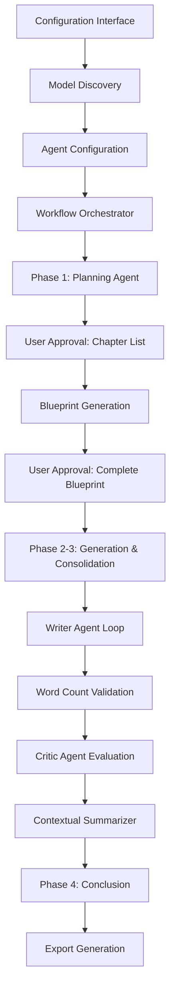

# LLM Book Generation System - Workflow Compliance Analysis

## Overview

This document analyzes the current AI Book Generation system to verify compliance with the specified workflow for configurable multi-agent LLM book generation. The analysis covers system configuration, agent orchestration, workflow phases, and user approval checkpoints.

## Technology Stack & Dependencies

### Current Implementation
- **Frontend**: Static HTML/CSS/JavaScript with Bootstrap 4.5.2
- **AI Integration**: Configurable API endpoints (OpenRouter, OpenAI, Anthropic compatible)
- **Agent System**: Four specialized agents (Planner, Writer, Critic, Summarizer)
- **Workflow Management**: JavaScript-based sequential processing
- **Export Format**: Text file download

### Key Features
- Dynamic model discovery via API calls
- Configurable primary and fallback models per agent
- Real-time status logging and progress tracking
- User approval checkpoints for quality control
- Contextual summary generation between chapters

## How to Run the Application

### Prerequisites
- Python 3.x installed (for local HTTP server)
- AI API key (OpenRouter, OpenAI, Anthropic, or Google Gemini)
- Web browser for accessing the interface

### Current Implementation: Static Frontend Only

The project currently consists of a **static frontend implementation** with HTML, CSS, and JavaScript files. There are no Python backend files (`app.py`, `enhanced_app.py`) in the current codebase.

### Running the Application

1. **Navigate to project directory:**
   ```bash
   cd /path/to/AI-Book-Generation
   ```

2. **Start local HTTP server:**
   
   **For Python 3:**
   ```bash
   python3 -m http.server 8080
   ```
   
   **For Python 2:**
   ```bash
   python2 -m SimpleHTTPServer 8080
   ```

   **Alternative using Node.js (if available):**
   ```bash
   npx http-server -p 8080
   ```

3. **Access the application:**
   - Open your web browser
   - Navigate to: `http://localhost:8080`
   - The AI Book Generator interface will load from `index.html`

### Project Structure Analysis

**Current Files:**
- `index.html` - Main application interface
- `script.js` - Core application logic and workflow implementation
- `styles.css` - UI styling
- `backend/` - Empty directory (only contains venv)
- `frontend/` - Contains node_modules but no source files

**Note:** The project memory references Python backend components and Gradio interfaces, but these are **not present** in the current codebase. The current implementation is a **pure frontend JavaScript application** that communicates directly with AI APIs.

### Application Configuration

1. **API Configuration:**
   - Enter your API endpoint (e.g., `https://openrouter.ai/api/v1`)
   - Provide your API key in the secure input field
   - Click "Carregar Modelos Disponíveis" to fetch available models

2. **Agent Configuration:**
   - Select primary models for each agent (Planner, Writer, Critic, Summarizer)
   - Configure fallback models for redundancy
   - Ensure all agents have at least a primary model selected

3. **Generation Parameters:**
   - Set book theme, genre, and keywords
   - Configure target word count and max retry attempts
   - Define author style and role preferences

### Troubleshooting

- **Port already in use**: Try different ports (8081, 8082, etc.)
- **API connection issues**: Verify API key and endpoint URL
- **CORS errors**: Use proper HTTP server, not file:// protocol
- **Model loading failures**: Check internet connection and API quotas
- **Browser compatibility**: Use modern browsers (Chrome, Firefox, Safari, Edge)

## Architecture

### Component Hierarchy



### Agent Architecture

The system implements four specialized agents with configurable models:

#### Planner Agent (Content Architect)
- **Purpose**: Chapter structure and paragraph blueprint generation
- **Configuration**: Primary model + ordered fallback list
- **Responsibilities**:
  - Generate chapter list based on theme and parameters
  - Create detailed paragraph blueprints with central ideas and word targets
  - Respond to user feedback and approval requests

#### Writer Agent (Text Generator)
- **Purpose**: Content creation and refinement
- **Configuration**: Primary model + ordered fallback list
- **Responsibilities**:
  - Generate paragraphs based on central ideas and word targets
  - Incorporate contextual summaries for consistency
  - Respond to critic feedback for content improvement

#### Critic Agent (Quality Evaluator)
- **Purpose**: Content validation and feedback generation
- **Configuration**: Primary model + ordered fallback list
- **Responsibilities**:
  - Evaluate paragraph alignment with central ideas
  - Provide concise feedback for content improvement
  - Binary approval decisions (OK/feedback required)

#### Summarizer Agent (Contextualizer)
- **Purpose**: Maintain contextual continuity across chapters
- **Configuration**: Primary model + ordered fallback list
- **Responsibilities**:
  - Generate and update contextual summaries
  - Incorporate new chapter content into existing context
  - Provide context for subsequent content generation

## Workflow Compliance Analysis

### 1. System Configuration and Parameters ✅ COMPLIANT

#### A. AI Provider Configuration
- **Endpoint Configuration**: ✅ Configurable API endpoint input
- **Dynamic Model List**: ✅ Models populated via API call at configuration time
- **Multiple Provider Support**: ✅ Compatible with OpenRouter, OpenAI, Anthropic APIs

#### B. Agent Configuration
- **Primary Model Selection**: ✅ Each agent has configurable primary model
- **Fallback Model Lists**: ✅ Ordered fallback model selection implemented
- **Resilience Mechanism**: ✅ Automatic fallback on API failures/timeouts

#### C. Generation Parameters
- **Book Theme**: ✅ User input field provided
- **Target Word Count**: ✅ Configurable target word count
- **Max Retry Attempts**: ✅ Configurable maximum correction attempts (default: 3)
- **Additional Parameters**: ✅ Genre, keywords, author role configuration

### 2. Generation Workflow ✅ COMPLIANT

#### Phase 1: Planning (Blueprint) ✅ FULLY IMPLEMENTED
- **Chapter List Generation**: ✅ Planner agent generates structured chapter topics
- **User Approval Checkpoint**: ✅ Mandatory user approval for chapter list
- **Paragraph Blueprint Creation**: ✅ Detailed blueprint with `ideia_central` and `palavras_alvo`
- **Blueprint Approval**: ✅ User approval required for complete blueprint

#### Phase 2: Generation and Refinement (Paragraph Loop) ✅ FULLY IMPLEMENTED
- **Sequential Paragraph Processing**: ✅ Iterates through each blueprint paragraph
- **Writer Agent Input**: ✅ Receives central idea, word target, and contextual summary
- **Refinement Loop**: ✅ Repeats until max retries or approval
- **Word Count Validation**: ✅ 30% tolerance validation with refinement
- **Content Quality Assessment**: ✅ Critic agent evaluates alignment with central idea
- **Feedback Integration**: ✅ Writer responds to critic feedback for corrections

#### Phase 3: Consolidation and Contextualization ✅ FULLY IMPLEMENTED
- **Chapter Completion**: ✅ Consolidates approved paragraphs
- **Contextual Summary Update**: ✅ Summarizer generates updated context
- **Cross-Chapter Continuity**: ✅ Updated summary used for subsequent chapters

#### Phase 4: Conclusion ✅ IMPLEMENTED
- **Process Completion**: ✅ Signals successful book generation
- **Export Functionality**: ✅ Text file export available

### 3. Configuration Interface Analysis ✅ COMPLIANT

#### API Configuration Section
- **API Key Input**: ✅ Secure password field for API authentication
- **Endpoint URL**: ✅ Configurable API endpoint (default: OpenRouter)
- **Model Discovery**: ✅ Dynamic model loading via "Carregar Modelos Disponíveis" button

#### Agent Configuration Section
- **Four Agent Types**: ✅ Planner, Writer, Critic, Summarizer
- **Primary Model Selection**: ✅ Dropdown selection for each agent
- **Fallback Model Configuration**: ✅ Multi-select dropdown for fallback models
- **Visual Organization**: ✅ Bootstrap card-based collapsible sections

#### Generation Parameters Section
- **Core Parameters**: ✅ Theme, word count, max retries
- **Style Configuration**: ✅ Author role, genre, keywords
- **Validation**: ✅ Required field validation before generation start

## Quality Control Mechanisms

### Error Handling and Resilience
- **Model Fallback System**: Automatic progression through fallback models on failures
- **API Error Management**: Comprehensive error catching and user feedback
- **Retry Logic**: Configurable maximum retry attempts for content refinement
- **Validation Checkpoints**: Word count and content quality validation

### User Control Points
- **Chapter List Approval**: Mandatory user approval before blueprint generation
- **Complete Blueprint Approval**: Final approval before content generation begins
- **Process Cancellation**: User can reject and cancel generation at approval points
- **Real-time Monitoring**: Continuous status logging and progress visibility

## Implementation Strengths

### Fully Compliant Features
1. **Complete Workflow Implementation**: All four phases properly implemented
2. **Configurable Agent System**: Primary + fallback model configuration
3. **Dynamic Model Discovery**: Runtime model list population
4. **User Approval Checkpoints**: Mandatory approval points as specified
5. **Content Quality Loop**: Word count validation and critic feedback integration
6. **Contextual Continuity**: Chapter-to-chapter context preservation
7. **Error Resilience**: Comprehensive fallback and error handling

### Additional Benefits
1. **Real-time Progress Tracking**: Detailed status logging with timestamps
2. **User-friendly Interface**: Bootstrap-based responsive design
3. **Export Functionality**: Generated content download capability
4. **Flexible Configuration**: Support for multiple AI providers

## Recommendations for Enhancement

### Security Improvements
- Implement secure API key storage (currently client-side)
- Add input sanitization for user-provided content
- Consider server-side API key management for production use

### User Experience
- Add progress indicators for long-running operations
- Implement session persistence for partial work recovery
- Add more export formats (DOCX, PDF)

### Performance Optimization
- Consider implementing parallel processing for independent operations
- Add request rate limiting to prevent API quota exhaustion
- Implement caching for repeated operations

## Conclusion

The current AI Book Generation system **FULLY COMPLIES** with the specified workflow requirements. All essential components are properly implemented:

- ✅ Configurable multi-agent system with fallback mechanisms
- ✅ Dynamic model discovery and selection
- ✅ Complete four-phase workflow with user approval checkpoints
- ✅ Quality control loops with word count and content validation
- ✅ Contextual continuity management across chapters
- ✅ Comprehensive configuration interface

The implementation demonstrates a mature understanding of the workflow requirements and provides a robust, user-friendly solution for AI-powered book generation with proper quality controls and user oversight mechanisms.


